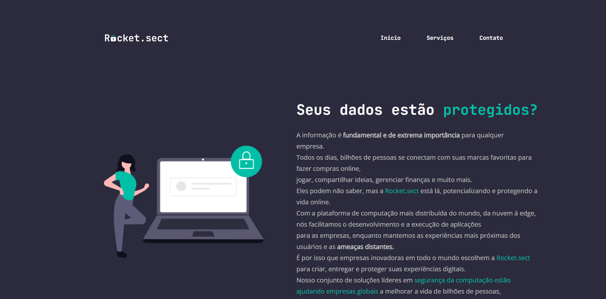

# 🧠 Projeto Recriando Layout

## 📚 Trilha Explorer

---

## 🛠️ Tecnologias

  

---

## 👨‍🎓 O que aprendi

- Estruturando HTML com tags semânticas
- Finalizando a estrutura do HTML semântico
- O conceito Box Model do CSS
- Conhecendo a ferramenta de desenvolvimento DevTools
- O conceito de Flexbox do CSS
- Melhorias na acessibilidade e refatoração
- Adicionando as fontes e melhorando os textos
- Aplicando alinhamentos e espaçamentos no main e no footer
- Configurando padlock

---

## 📧 Contato

<a href = "mailto:probertos717@gmail.com">